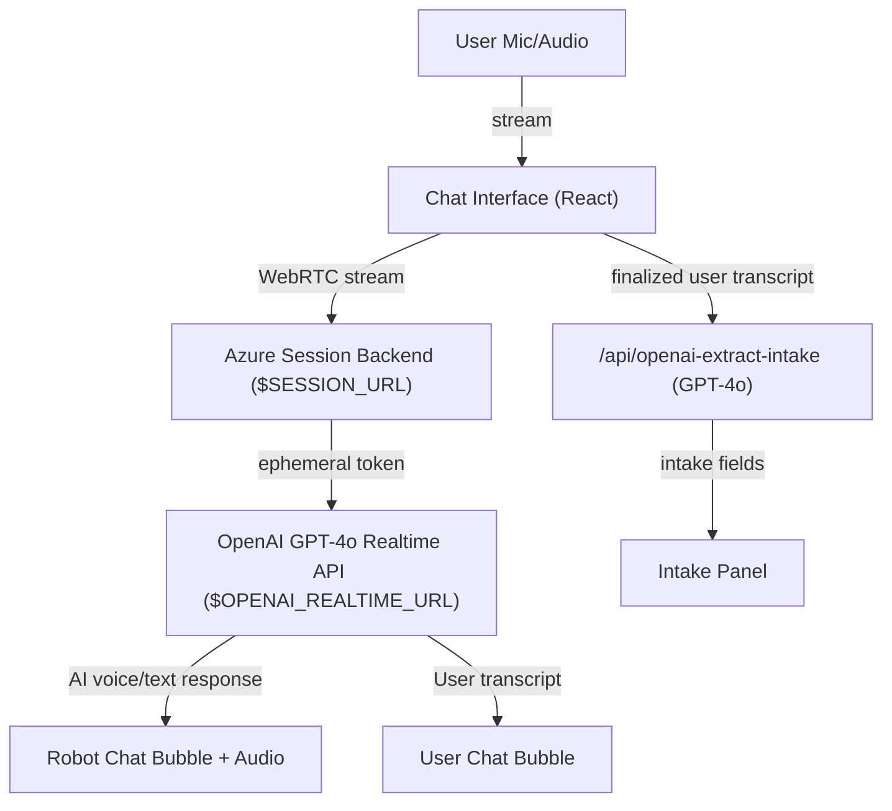

# 🎤 Real-Time Voice Chat Demo (OpenAI GPT-4o Realtime)

A modern, real-time voice chat demo built with Next.js, React, shadcn/ui, and Tailwind CSS. This app streams user voice to OpenAI's new GPT-4o Realtime API for voice-to-voice AI chat and live user transcription. No Whisper, no local proxy, no mode switching required.

## ⚠️ Requirements

- **Next.js**: 15.1.8 (LTS)
- **React**: 19.1.0 (LTS)
- **Node.js**: 20.x (LTS) recommended

## ✨ Features

- 🎙️ Real-time voice input (Web Audio API)
- 🗣️ Voice-to-voice chat with OpenAI GPT-4o Realtime API (via Azure session backend)
- 📝 User transcription and intake extraction powered by GPT-4o Realtime (no Whisper)
- 💬 AI responses (text or transcript) shown as robot chat bubbles
- 💎 Modern, accessible UI (shadcn/ui, Tailwind CSS)
- 📱 Responsive, fixed-width chat area for stable layout
- 🔥 Single "Voice Chat" toggle button (orange/red), no mode switching, no WebRTC jargon
- 🗂️ **Cumulative intake extraction:** All finalized user speech is concatenated and sent to `/api/openai-extract-intake`, which uses GPT-4o to extract and merge intake fields (name, phone, insurance, etc.) cumulatively. The intake panel always shows the latest, most complete set of user-provided data.
- 🛣️ **Subdirectory support:** Frontend auto-detects base path for API calls, supporting both root and subdirectory deployments (e.g., GitHub Pages).

## 🛠️ Tech Stack

- **Framework:** Next.js 15.1.8 (React 19.1.0, TypeScript)
- **UI:** shadcn/ui, Tailwind CSS
- **API:** OpenAI GPT-4o Realtime (voice-to-voice, user transcription, and intake extraction)
- **Voice:** Web Audio API, MediaRecorder

## 🚀 Getting Started

1. **Clone the repository**
   ```bash
   git clone <your-repo-url>
   cd voice-chat-demo
   ```

2. **Install dependencies**
   ```bash
   npm install
   ```

3. **Configure Environment Variables**
   Create a `.env.local` file in the project root:
   ```
   NEXT_PUBLIC_OPENAI_API_KEY=your_openai_api_key_here
   NEXT_PUBLIC_SESSION_URL=https://your-azure-backend/session
   NEXT_PUBLIC_OPENAI_REALTIME_URL=https://api.openai.com/v1/realtime?model=gpt-4o-realtime-preview-2024-12-17
   ```

4. **Run the development server**
   ```bash
   npm run dev
   ```

Open [http://localhost:3000](http://localhost:3000) to view the app.

## 🏗️ Static Export & Deployment

> **Warning:** API routes (including `/api/openai-extract-intake`) require a serverless or Node.js backend. They will NOT work on static-only hosts like GitHub Pages. For dynamic features, deploy to Vercel, Netlify, or your own backend.

To generate a static export (for deployment to static hosting):

```bash
npm run build
```

- For subdirectory deployments (e.g., GitHub Pages), the frontend auto-detects the base path for API calls, but API routes will return 404 unless you deploy to a platform that supports serverless functions.

## 🧠 Intake Extraction (GPT-4o)

- All finalized user speech is concatenated and sent to `/api/openai-extract-intake`.
- The backend uses GPT-4o to extract and merge intake fields (name, phone, insurance, etc.) cumulatively.
- The intake panel always shows the latest, most complete set of user-provided data.

## 📝 Known Limitations

- API routes will not work on static-only hosts (e.g., GitHub Pages). Use Vercel/Netlify or a custom backend for dynamic features.
- Some edge cases in audio streaming/playback may need further handling.
- All Gemini/Google code removed; all OpenAI endpoints are functional.

## 🗂️ Project Structure

- `src/components/chat-interface.tsx` – Main chat interface (voice-to-voice, UI)
- `src/components/ui/chat-bubble.tsx` – Chat bubble UI component
- `src/lib/openai.ts` – OpenAI API utility
- `src/app/api/openai-transcribe/route.ts` – Whisper API endpoint (for user transcription)
- `memory-bank/` – Project documentation and context

## 📝 How It Works

- When you start a voice chat, your audio is streamed in real time to the Azure backend for session management and then to the OpenAI GPT-4o Realtime API for both AI voice response and live user transcription.
- The OpenAI GPT-4o Realtime API provides:
  - Real-time AI voice and text responses (played back and shown as robot chat bubbles)
  - Real-time streaming user transcription (shown as a user chat bubble as you speak)
- All finalized user speech is concatenated and sent to `/api/openai-extract-intake`, which uses GPT-4o to extract and merge intake fields (name, phone, insurance, etc.) cumulatively. The intake panel always shows the latest, most complete set of user-provided data.
- All chat logic and UI is handled client-side in React.
- The UI is stable, accessible, and mobile-friendly.

## 🗺️ Architecture



- All backend URLs are set via environment variables.
- No Whisper, no local proxy, no mode switching.

## 📄 License

MIT License. See [LICENSE](./LICENSE) for details.
