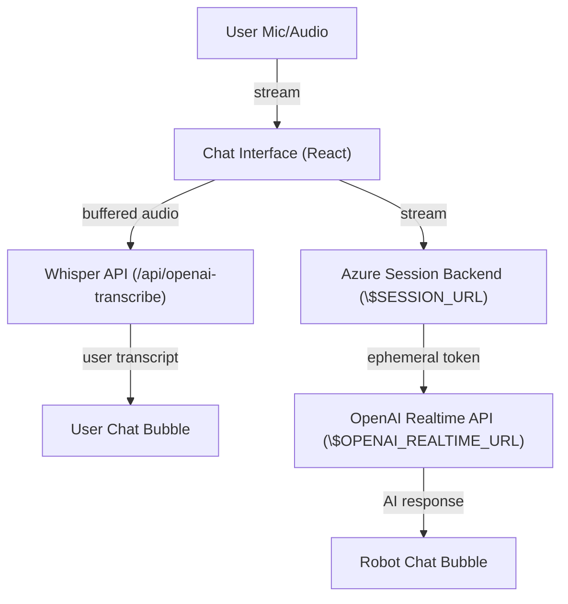

# 🎤 Real-Time Voice Chat Demo (OpenAI GPT-4o + Whisper)

A modern, real-time voice chat demo built with Next.js, React, shadcn/ui, and Tailwind CSS. This app streams user voice to OpenAI Whisper for transcription and uses OpenAI GPT-4o Realtime API for voice-to-voice AI chat. No local proxy or mode switching required.

## ⚠️ Requirements

- **Next.js**: 15.1.8 (LTS)
- **React**: 19.1.0 (LTS)
- **Node.js**: 20.x (LTS) recommended

## ✨ Features

- 🎙️ Real-time voice input (Web Audio API)
- 🗣️ Voice-to-voice chat with OpenAI GPT-4o Realtime API (via Azure session backend)
- 📝 User transcription with OpenAI Whisper (runs in parallel, user bubble shown as soon as you finish speaking)
- 💬 AI responses (text or transcript) shown as robot chat bubbles
- 💎 Modern, accessible UI (shadcn/ui, Tailwind CSS)
- 📱 Responsive, fixed-width chat area for stable layout
- 🔥 Single "Voice Chat" toggle button (orange/red), no mode switching, no WebRTC jargon

## 🛠️ Tech Stack

- **Framework:** Next.js 15.1.8 (React 19.1.0, TypeScript)
- **UI:** shadcn/ui, Tailwind CSS
- **API:** OpenAI Whisper (speech-to-text), OpenAI GPT-4o Realtime (voice-to-voice)
- **Voice:** Web Audio API, MediaRecorder

## 🚀 Getting Started

1. **Clone the repository**
   ```bash
   git clone <your-repo-url>
   cd voice-chat-demo
   ```

2. **Install dependencies**
   ```bash
   npm install
   ```

3. **Configure Environment Variables**
   Create a `.env.local` file in the project root:
   ```
   NEXT_PUBLIC_OPENAI_API_KEY=your_openai_api_key_here
   NEXT_PUBLIC_SESSION_URL=https://your-azure-backend/session
   NEXT_PUBLIC_OPENAI_REALTIME_URL=https://api.openai.com/v1/realtime?model=gpt-4o-realtime-preview-2024-12-17
   ```

4. **Run the development server**
   ```bash
   npm run dev
   ```

Open [http://localhost:3000](http://localhost:3000) to view the app.

## 🏗️ Static Export

To generate a static export (for deployment to static hosting):

```bash
npm run build
```

The static site will be output to the `out/` directory.  
No need to run `next export`—Next.js handles static export automatically with `output: 'export'` in `next.config.ts`.

## 🗂️ Project Structure

- `src/components/chat-interface.tsx` – Main chat interface (voice-to-voice, Whisper, UI)
- `src/components/ui/chat-bubble.tsx` – Chat bubble UI component
- `src/lib/openai.ts` – OpenAI API utility
- `src/app/api/openai-transcribe/route.ts` – Whisper API endpoint
- `src/app/api/openai-chat/route.ts` – Chat completions endpoint
- `memory-bank/` – Project documentation and context

## 📝 How It Works

- When you start a voice chat, your audio is streamed to the Azure backend for session management and OpenAI Realtime API for AI voice response.
- At the same time, your audio is buffered and sent to OpenAI Whisper for transcription as soon as you finish speaking. The transcript is shown as a user chat bubble.
- The AI's response (text or transcript) is shown as a robot chat bubble, with no duplicates.
- The UI is stable, accessible, and mobile-friendly.

## 🗺️ Architecture



- All backend URLs are set via environment variables.
- No local proxy or mode switching.

## 📄 License

MIT License. See [LICENSE](./LICENSE) for details.
